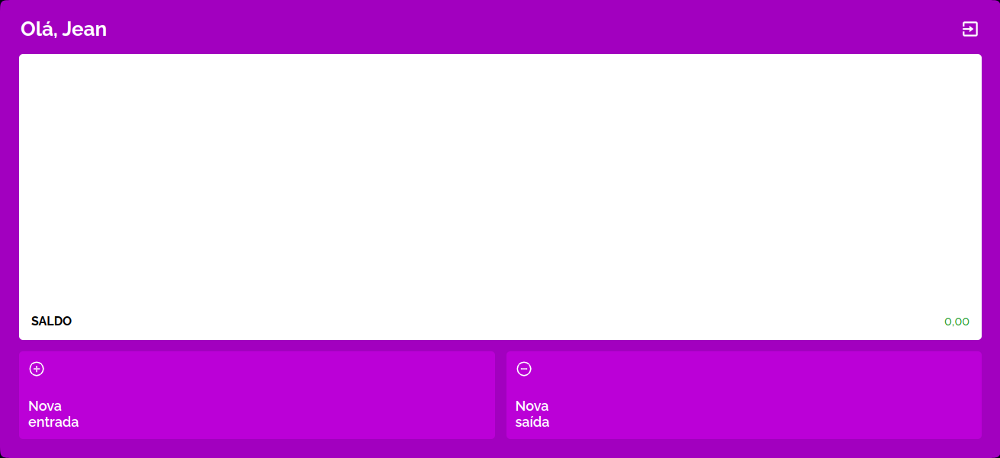

# MyWallet-front
Front-end application app for a financial management app. <a href="https://projeto14-mywallet-front-indol-eta.vercel.app/home">Demo</a>

# Funcionality
This is a website with a login system that allows the user to create income and outcome transactions, edit transactions, delete transactions and the total amount.

# Tecnologies used
- axios
- react
- react-dom
- styled-components
- vite

# How to run 
- Clone repository
- Use `npm install`
- Create file `.env` as seen in `.env.example`
- To run in dev mode use `npm run dev`
- To run in deploy mode use `npm run build`